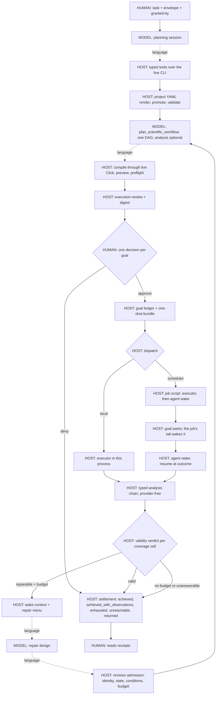

# ChemSmart Product Charter

## Mission

ChemSmart is the canonical, CLI-first hub through which humans and AI agents
operate computational-chemistry programs. Scientific intent belongs in
readable project YAML and typed scientific DAGs. ChemSmart validates that
intent, materialises program-native inputs, compiles the public CLI, controls
execution, and returns typed scientific evidence.

The model is a computational scientist, not an input-file generator. It may
choose a defensible method, program, decomposition, and interpretation when a
task leaves them open. It must not bypass ChemSmart by inventing native input,
shell commands, execution status, or result values.

## Architecture

One driver runs every goal, and every entry point is a view of it: the
``goal`` command, the ``plan`` command, and the terminal interface. Solid
edges are code-enforced; dotted edges are where the model chooses and the
host checks only the result.

## Product boundary for version 3.1.4

The production Agent supports:

- project-YAML creation and validation;
- ChemSmart CLI compilation and safe preview;
- causal scientific workflow planning;
- inspection and typed analysis of supported results; and
- explicitly approved execution on release-qualified CPU paths: ORCA
  single-points, optimization/frequency, transition-state, excited-state,
  relaxed coordinate scans, intrinsic reaction coordinates, and serial DAG
  workflows; PySCF ``sp/opt/hess/td``, optimisation on an excited root,
  and the ``mp2``, ``ccsd`` and ``ccsd(t)`` methods, each recorded from
  a sealed live goal on the configuration it ran; and xTB
  ``sp/opt/hess``.

## Authority and approval chain

Planning, YAML validation, CLI compilation, safe preview, and result analysis
do not grant engine authority. Real calculation follows this chain:

1. the Agent produces a project-backed DAG;
2. ChemSmart compiles and safely previews every executable node while retaining
   any scientifically necessary release-unsupported stage as explicit
   non-executable intent;
3. the terminal interface displays the complete plan, marks non-executable
   stages and their reasons, and displays molecular identity, electronic state,
   effective project settings, CLI operations, dependencies, environment, and
   resources for the executable partition;
4. a human enters ``/approve`` once, or chooses ``/deny`` or ``/revise``;
5. the displayed workflow is removed from the pending state before launch;
6. a provider-free executor runs only that reviewed executable partition; and
7. ChemSmart records engine and validation evidence; a typed analysis chain
   displayed and approved with the workflow then executes provider-free in
   the same run, recording extraction, thermochemistry, expression,
   validation-verdict, and claim receipts, while scientific interpretation
   and the recorded decision remain a subsequent explicit session act; a
   workflow approved without an analysis chain keeps the prior behavior, and
   a later explicit analysis request may always read completed results.

## Charter topics

What each surface was qualified by, what it found, and what is
deliberately not claimed lives verbatim in the topic files below. Read
the topic before changing or describing that surface. Capability state
is computed, not narrated: ``chemsmart agent capabilities`` and
``chemsmart/agent/qualification/release.json``.

- `.agents/charter/architecture.md` -- step machine and resume, stem-and-guide tool tree, rule registry, capability ladder
- `.agents/charter/orca-scan-irc-modred.md` -- ORCA scan and irc qualification, why irc declares no state selectors, modred preview-only
- `.agents/charter/analysis-chain-and-validation.md` -- approved analysis chain; acceptance criteria reaching the claims they judge
- `.agents/charter/geometry-origins.md` -- compose, public-identifier lookup, derive; none binds an electronic state
- `.agents/charter/producer-edges.md` -- producer-Hessian and scan-minimum edges; which is completed execution
- `.agents/charter/constants-and-pka.md` -- literature-constants registry; aqueous pKa as a composed workflow
- `.agents/charter/batch-database.md` -- N records under one decision: database records, envelope enforcement, resume and replay
- `.agents/charter/geometry-editing-and-symmetry.md` -- edit / append / displace / break_symmetry, adjacency policy with signed margins, builder symmetry and saddles
- `.agents/charter/vibrational-modes.md` -- per-atom mode participation and degeneracy groups
- `.agents/charter/redox-constants-pcet.md` -- electrode potentials, convention families of constants, impossible states, the PCET square scheme
- `.agents/charter/solvation-and-populations.md` -- ORCA solvation terms, populations named by scheme, the reader defect a delivery found
- `.agents/charter/pyscf.md` -- extraction plane, contracts v4-v6, td / excited-root / correlated stages, provenance axis, surfaces, numerical Hessians, sealed goals and repaired losses
- `.agents/charter/crossprogram.md` -- multi-program qualification, bound identity as state authority, geometry handoff, why equal level strings are not equal methods
- `.agents/charter/other-programs-probe-providers.md` -- Gaussian / GPU4PySCF / NEB / NCIPLOT status, the ORCA input-check probe, provider-neutral orchestration
- `.agents/charter/dispatch-excursion-results-review.md` -- scheduler dispatch and wake, excursion line, results registered by content id, review built while planning
- `.agents/charter/validity-rules.md` -- stationary-point rule, spin observation, small-imaginary-mode anomaly, coverage cells
- `.agents/charter/goal-grain-recovery-wake.md` -- goal as the unit of decision, admitted revisions, recovery and repair menus, approaches_tried, diagnostic declarations
- `.agents/charter/delivery-precision-uncertainty.md` -- delivery and supersession, met / attested / short / unstated, estimators, measured vs asserted, unreachable precision
- `.agents/charter/settlement-and-terminal-records.md` -- settlement words, goal-grain delivery, verified refusal, terminal records, failed results as evidence, cancellation

## Evidence graph and research loop

How this repository remembers and how it improves are part of its
development method, not an appendix. They are a working hypothesis with
a falsifier, recorded in `.agents/research/ledger.jsonl`: if sessions
that are shown these affordances do not use them, or use them without
better outcomes, they are removed.

- **Retrieve, do not preload.** This file is the kernel; everything else
  is one lookup away. `python .agents/research/loop/graph.py find
  <word | rule id | commit>` says where to start and `graph.py why
  <node>` answers what protects, earned, verifies, reads or superseded
  an instruction, a result or an open candidate; `graph.py cost` and
  `graph.py orphans` say
  what an always-on sentence costs and what stands behind it;
  `chemsmart agent capabilities` is the state of every capability;
  `MAINTENANCE.md` holds what worked and under what conditions;
  `CONDUCT.md` binds every change.
- **Evidence is linked, not narrated.** An observation, a falsified
  premise, a negative result, a decision and the commit that replaced a
  sentence are ledger rows and graph edges (`evidenced_by`,
  `supersedes`, `backstopped_by`), each naming what it is about --
  `product`, `agent_context` or `research_loop`, three kinds that never
  share a commit. A lesson points at its source; it never restates it.
- **Research runs in generations.** `python
  .agents/research/loop/generation.py open` scores the previous
  generation's sealed forecasts before anything else; `reflect` assigns
  outcomes to the loop component responsible; candidates are enumerated
  across all three kinds; a choice and its forecast are recorded before
  it runs; the loop itself (`.agents/research/loop.yaml`) is mutated only
  by `promote`, on ledger evidence. No target is named in advance. Start
  from `.agents/research/BOOTSTRAP.md` and `STATE.md`.
- **A delegated investigator is shown all of this.** A brief names the
  graph and the ledger as readable evidence and asks for findings as
  rows that can be appended; an affordance that was never shown has not
  been tested.
- **Every persistent sentence competes** against deleting one, narrowing
  one, retrieving it just in time, or a deterministic invariant. This
  kernel stays under 2,000 words, and `census.py` measures it.

## Scientific invariants

Before materialisation, establish the facts that determine meaning:

- molecular identity and the role of each geometry;
- coordinate units and atom order;
- charge, multiplicity, electronic state, and constraints;
- requested observable and physical conditions;
- method or program requirements fixed by the question; and
- whether the task requests planning, preview, analysis, or execution.

Ask rather than invent a consequential missing fact. Never infer identity or
state from a filename. Preserve artifact lineage across geometry handoff and
state changes. Keep signs, dimensions, units, standard states, temperature,
pressure or concentration, and thermochemical conventions explicit.

Normal process exit is not scientific validation. Distinguish, in order:

- proposed;
- planned;
- materialised;
- previewed;
- approved;
- executing;
- engine-complete;
- parsed;
- scientifically validated; and
- interpreted.

Only the deterministic host owns these states. Provider text is not execution
evidence, and hidden model reasoning is never scientific evidence.

## Product differentiation

ChemSmart does not compete by maximising autonomy or agent count. Its value is
the separation of flexible scientific reasoning from a reproducible,
multi-program execution authority:

- one public YAML-and-CLI layer instead of model-authored native inputs;
- molecular, electronic-state, artifact, and geometry-lineage preservation;
- preview and one explicit human decision over the displayed scientific and
  resource state;
- provider-independent execution semantics;
- native outputs plus typed, unit-aware analysis rather than transcript-only
  provenance; and
- explicit maturity claims for each program and operation.

Do not force one paper answer, molecule-specific branch, preferred DAG, tool
order, or reporting style. Algebraically equivalent transformations and
scientifically stronger program-native routes are acceptable when their
evidence chain is complete.

## Implementation discipline

- Treat live project loaders and Click commands as the public authority.
- Keep provider protocol code inside registered adapters.
- Use the smallest existing architectural layer that owns a defect.
- Do not create a parallel orchestration, scheduler, or grading system.
- Preserve unrelated working-tree changes; never reset, clean, or overwrite
  user work without explicit authority.
- Do not commit credentials, user configuration, engine binaries, generated
  inputs, outputs, scratch data, private transcripts, or one-off reports.
- Keep controller and program compute environments explicit in user or server
  YAML. Never replace an operator-selected executable implicitly.
- Validate a target host from its actual operating system, architecture,
  scheduler, program builds, and resource limits. No single cloud or server is
  the universal reference.

After a material change, run one focused mechanical check and then prefer a
decisive real scientific observation. Tests verify mechanics; they do not
grade computational-chemistry intelligence. Never claim an engine run from a
fake preview, fixture, parser test, or source inspection.

## Human scientific review

The human scientist owns interpretation and publication. Evaluate whether
identity, state, method, numerical transformations, units, conditions,
dependencies, and limitations are coherent. Accept creative valid routes.
Reject invented data, unperformed actions presented as completed, silent
changes to the scientific problem, and invalid chemistry or mathematics.

Report the route, strong scientific decisions, consequential limitations, the
general ChemSmart capability involved, and exactly what was planned,
previewed, executed, parsed, validated, or inferred.

## Documentation and repository hygiene

User documentation lives under `docs/source` and describes released public
behavior only. It must not contain development diaries, hidden evaluation
rubrics, private infrastructure, future implementation status, or internal
class inventories. `README.md` is a concise human entry point.

This charter and `.agents/skills/chemsmart-agent/SKILL.md` are the two
governance exceptions. Keep them aligned with the live product. The repository
source and CLI win if either instruction becomes stale.
