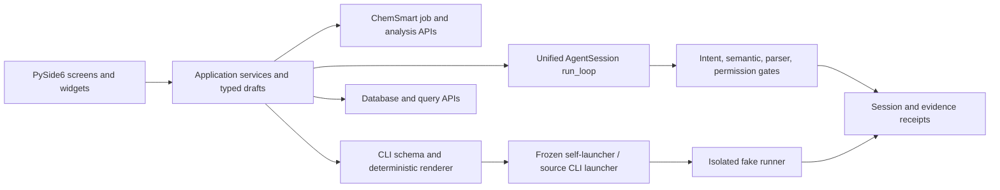

# ChemSmart Native Desktop Master Plan

Status: P6 complete in `83eb1707`; P7 pending, 2026-07-19
Owner: ChemSmart maintainers
Primary target: Zhang Lab internal macOS desktop app
Framework: Python 3.10/3.11 + PySide6/Qt 6
Canonical feature contract: `docs/design/chemsmart_desktop_feature_contract.yaml`
Baseline UI review: `docs/design/chemsmart_gui_baseline_review.md`

This document supersedes the phase ordering in
`/Users/hongjiseung/.claude/plans/iridescent-finding-sifakis.md` while preserving
its approved product decisions. The Claude plan remains the design-research
record; this file is the implementation contract shared by Claude and Codex.

## 1. Outcome and boundaries

The outcome is a native ChemSmart desktop application that Zhang Lab members can
install and use without opening a terminal for the supported desktop workflows.
It is not a rewrite of ChemSmart. The existing CLI, Textual TUI, agent harness,
database, job builders, and analysis libraries remain the domain implementation.
The desktop app is a typed application layer over them.

Approved product decisions:

- New native PySide6 UI; the Textual TUI remains supported but is not embedded.
- macOS `.app`/`.dmg` first; Windows packaging follows after the macOS contract is
  stable.
- v1 provider UI supports OpenAI and Anthropic APIs. Local models remain CLI-only.
- v1 does not submit HPC jobs and does not run real Gaussian/ORCA compute.
- v1 includes Job builder, agent chat, fake dry-run/input preview, database
  browsing, create-new database assembly and verified export, conformer grouping,
  thermochemistry, and interactive 3D structure viewing. PyMOL rendering is
  optional. Standalone xTB opt, sp, and hess have passed their backend-lineage,
  CLI/fake-run, and desktop artifact-parity gates; the GUI exposes local-file safe
  preview only.
- Zhang Lab internal alpha may be unsigned/ad-hoc signed. A broadly distributed
  release is not complete until Developer ID signing and notarization pass.

Non-goals for v1:

- SSH credential management or a new remote scheduler transport.
- Reimplementation of Gaussian, ORCA, database, grouper, or thermochemistry
  business logic inside GUI code.
- Automatic approval of `run_local` or `submit_hpc`.
- Bundling local LLM weights or inference runtimes.

## 2. Corrected current baseline

P0 through P4 are committed through
`agent-codebase-simplification@5067903d`; P5 is implemented on the phase worktree
containing this plan. Before the P5 commit the branch is five local commits ahead
of and six commits behind
`fork/agent-codebase-simplification`. Do not use `git clean`, `git stash -u`,
reset, or branch switching as a preparation step.

| Area | Current state | Consequence |
|---|---|---|
| Packaging spike | P1 complete; PyInstaller selected and freshly reconfirmed | Authorized run `29668168830` reconfirmed all 18 PyInstaller gates. pyside6-deploy compiled but its strict normalizer rejected the expected 19-byte `Contents/MacOS/qt6.conf`; it remains a non-blocking experimental fallback. |
| PySide6 extra and GUI entry point | P0 committed | Source entry and package data are stable; P1 adds a hidden packaging probe and absolute-path frozen CLI dispatch. |
| Provider config and secrets | P2 reviewer-green | Provider literals remain backward-readable; new credentials use unique staged Keychain references, atomically commit YAML, then retire the old reference. Secret-bearing tasks disable retry retention. Tests use in-memory stores and never touch the real Keychain. |
| App shell/theme | P6 reviewer GREEN | Native menus, scroll-safe Settings, system palette/font roles, adaptive three-region layout, status, complete accessible labeling, explicit dynamic focus order, Help, and bounded runtime evidence projection are present. The 81-screen size/appearance matrix and 18 pt minimum-window scientific controls are accepted with Critical 0, High 0, Medium 0. |
| Job builder | P4 handoff complete | All 29 Gaussian/ORCA/xTB leaves retain P3 parity and safety. A draft can enter Chat only after an accepted safe-preview receipt; any edit revokes that handoff. A gated agent draft loads as typed state with receipt provenance and requires a new isolated preview before it can be sent onward. |
| Chat | P4 complete | The native screen runs the canonical unified `run_loop()`, streams bounded durable decision projections, exposes distinct intent/semantic gates, honest indeterminate progress and cooperative cancellation, provider setup/error recovery, recent-session resume, retry, and two-way typed Job Builder handoff. Exact `chemsmart run` input has a deterministic no-provider path. |
| Agent worker | P4 complete | A read-only desktop registry excludes repair, execution, submission, and project-writing tools while preserving CLI/TUI repair behavior. The adapter reuses canonical session/decision/runtime stores, an explicit `PermissionPolicy`, typed receipts, and strict `ok` + `ready` + two-gate + live-parser handoff acceptance; it does not introduce a second agent event store. |
| 3D viewer | P6 optional renderer complete | Integrity-checked 3Dmol.js 2.5.5 remains the offline default and renders in the selected PyInstaller QtWebEngine bundle. Optional PyMOL uses an explicit/PATH executable, cancellable no-shell process group, bounded verified PNG, persisted Finder-safe setting, and honest absent/error/retry states. Real PyMOL on a named machine remains P7. |
| Database/analysis | P5 automated gates green | Database browse/query/detail and shared 3D preview are live. Explicit create-new assembly and JSON/CSV/XYZ/extXYZ export use shared domain rules, bounded input, private staging, integrity/readback/hash gates, an irreversible cancellation commit point, and atomic no-overwrite publication. Grouper, Thermochemistry, DIAS, and WBI/NBO population analysis run through typed domain adapters with bounded inputs and no implicit output writes. Strategy-specific units/defaults and optional-dependency availability are explicit; DIAS reference identity and NPA/NAO fail-closed behavior are regression-tested. |
| Runtime environment | Split | Base Python can render PySide6; the `chemsmart` conda environment lacks PySide6. The current `chemsmart` executable on `PATH` resolves to another Codex worktree. |
| Validation | P6 automated and independent gates green | The final complete GUI suite passes 358 tests with one explicit optional-dependency skip; Agent passes 1,110 tests; Grouper/Thermochemistry/Analysis service passes 143 tests with seven explicit optional/external skips. The final independent review reports Critical 0, High 0, Medium 0 after measuring large-text geometry and real forward/reverse focus order. Exact evidence is retained in `docs/design/phase_receipts/p6_product_accessibility.md`. |

The native Job builder, Chat, Database, and Analysis are runnable source-checkout
product slices. A Finder-launched distributable remains a P7 completion gate.

## 3. Product experience

### 3.1 Information architecture

Use a native desktop three-region layout:

```text
┌──────────────────────────────────────────────────────────────────────┐
│ macOS menu bar: File  Edit  View  Job  Window  Help                 │
├──────────────┬───────────────────────────────────┬───────────────────┤
│ Sidebar      │ Primary work surface              │ Context inspector │
│              │                                   │ (collapsible)     │
│ Build        │ Job builder / Chat                │ Structure / input │
│  Job builder │                                   │ validation /      │
│  Chat        │ Explore surfaces                  │ provenance        │
│ Explore      │ Database / Grouper / Thermochem   │                   │
│  Database    │                                   │                   │
│  Analysis    │                                   │                   │
├──────────────┴───────────────────────────────────┴───────────────────┤
│ Status: provider · project · safe/fake mode · background task       │
└──────────────────────────────────────────────────────────────────────┘
```

- Job builder is the default work surface.
- Database and Analysis are separate surfaces, not job types in the builder.
- Settings opens from the application menu and `Command-,`; it is not a primary
  sidebar destination.
- The right inspector hosts structure preview, generated `.com`/`.inp`, semantic
  checks, and evidence. It collapses before the main work surface at narrow
  widths.
- Critical actions remain above the lower window edge. A status bar can occupy
  the bottom because it is noncritical.

### 3.2 Apple-design quality gates

The installed `apple-design` skill supplies the review rules. Translate them to
PySide6 as follows:

- Accessibility: every control has an accessible name/description, label buddy,
  logical focus order, and keyboard route. Desktop controls are at least 28 pt by
  default and never below 20 pt. State is conveyed by text/icon as well as color.
- Typography: use `QFontDatabase.systemFont()` for UI and fixed-width system font
  for commands/numbers. Avoid hard-coded font families and pixel-only text sizes.
  The optional serif voice may distinguish assistant prose, but must preserve
  legibility and user font settings.
- Color: use `QPalette` semantic roles as the base, add one ChemSmart accent, and
  supply light, dark, and increased-contrast validation. Do not freeze macOS
  system colors as custom hex values.
- Layout: replace the fixed sidebar/body split with `QSplitter` or equivalent
  adaptive constraints; test the minimum supported window, half-screen, full
  screen, long localization strings, and increased font size.
- Onboarding: app launch is never blocked solely because an AI provider is not
  configured. The non-AI Job builder remains usable. Chat shows a setup call to
  action and onboarding can be resumed from Settings.
- Data entry: use file pickers/drag-and-drop, typed spin boxes and validators,
  choices instead of free text where the CLI schema supplies an enum, inline
  validation, and disabled primary actions until required inputs are valid.
- Generative AI: clearly mark AI output, disclose what request/context is sent to
  the provider, show commands before any action, retain retry/edit/dismiss
  controls, and expose deterministic gate receipts.
- Settings: respect system appearance and accessibility automatically. Provider,
  workspace, and optional PyMOL paths belong in Settings; job-specific settings
  remain in the active job surface.

### 3.3 Core workflows

Job builder vertical slice:

1. Choose Gaussian, ORCA, or xTB. xTB is local-file-only in v1.
2. Choose a real job kind from the current CLI schema.
3. Select molecule source: file, PubChem, or CHEMSMART database selector.
4. Select project/defaults and edit user-owned settings.
5. Validate the typed draft and render the exact command.
6. Run only `--fake --no-scratch` in an isolated workspace.
7. Show generated input, route, structure, parser verdict, and source files.
8. Save the draft or send the structured draft to Chat.

Chat vertical slice:

1. User enters a chemistry request.
2. Unified agent streams prose, tool calls, and deterministic receipts.
3. Risky tools are unavailable in the desktop-safe profile.
4. A produced job opens as a typed `JobDraft` in Job builder.
5. The user edits and dry-runs it; Chat never silently executes it.

Analysis vertical slice:

1. Select database/results or drag files into Grouper/Thermochemistry.
2. Validate inputs before starting a background task.
3. Show progress/cancel state and structured results.
4. Compare the result against the same library/CLI call in contract tests.

## 4. Architecture



### 4.1 Layer boundaries

`chemsmart/gui/presentation/` or the existing `screens/` and `widgets/`:

- Qt-only view composition and presentation state.
- No chemistry rules, YAML template replacement, shell command construction, or
  database calculations.

`chemsmart/gui/application/`:

- Typed use cases: `JobDraft`, `MoleculeSource`, `DryRunRequest`,
  `AnalysisRequest`, `ProviderSetupDraft`, and result DTOs.
- Form validation, asynchronous task lifecycle, cancellation, and handoffs.

`chemsmart/gui/adapters/` or the existing `services/`:

- Narrow adapters over the current CLI schema, agent session, database, grouper,
  thermochemistry, molecule export, and fake runner.
- Convert domain results into GUI DTOs; never duplicate scientific logic.

Existing ChemSmart domain and runtime:

- Remains the source of truth.
- Changes are allowed only when extracting a pure shared function that both CLI
  and GUI call, with regression tests proving CLI behavior is unchanged.

### 4.2 Typed JobDraft contract

Do not use a shell string as GUI state and do not make Chat-to-Builder depend on
reverse-parsing a rendered command. Use a typed object:

```text
JobDraft
  program: gaussian | orca | xtb (only after the missing-backend gate passes)
  kind: current CLI subcommand name
  source: file | pubchem | database selector | prior artifact
  project: optional workspace project reference
  charge, multiplicity: optional explicit user values
  settings: schema-validated user-owned kind settings
  resources: fake-run resource preview only
  provenance: manual | agent session/tool receipt
```

One renderer maps `JobDraft -> argv`; one parser maps compatible existing argv to
`JobDraft`; both are tested against Click. Agent structured results map directly
to the draft. Runtime-owned project defaults stay out of agent model targets.

### 4.3 CLI schema adapter

The adapter must traverse and merge options in order:

```text
run group -> gaussian/orca program group -> job-kind leaf
```

It must preserve Click placement rules when rendering each level. The Job
builder exposes Gaussian, ORCA, and the reviewed xTB leaf set; Database, Grouper, Mol, and
Thermochemistry have dedicated screens. Default flag polarity (`--foo` versus
`--no-foo`), repeated values, tuples/lists, choices, and source-selector
exclusivity require explicit tests.

### 4.4 Unified agent adapter

The current TUI contract is authoritative:

- Construct `AgentSession(stage_prompt="unified_agent.md", ...)`.
- Call `run_loop()` with an explicit `PermissionPolicy` and approver.
- Stream tool requests, decisions, receipts, and final output through Qt signals.
- Define a desktop-safe registry/profile. `submit_hpc` and `run_local` are not
  registered or are deterministically denied. Any command execution exposed to
  v1 is forced to fake/test mode.
- Keep the intent gate and semantic gate distinct in the UI and evidence model.

Do not wire the placeholder to legacy `AgentSession.run()` merely because that
method exists.

### 4.5 Process launcher

Source checkout and frozen app execution need the same interface:

```text
CliLauncher.resolve() -> explicit executable argv
```

- Source mode resolves the active checkout/installed entry point and verifies its
  package root before use.
- Frozen mode self-dispatches the app executable into a hidden CLI entry point or
  invokes a bundled companion executable by absolute path.
- Never rely on ambient `PATH`; it currently resolves to another worktree on the
  development machine.
- Child processes receive an explicit environment, cwd, timeout, cancellation,
  and fake/test invariant.

### 4.6 Configuration and secrets

- Extract `ensure_user_config_tree(register_shell=False)` from CLI setup. GUI
  first launch may copy templates but must not edit `.zshrc`, PowerShell
  profiles, registry PATH, or `PYTHONPATH`.
- Store API keys in macOS Keychain through a cross-platform secret abstraction;
  YAML stores provider/model and a key reference, not the literal key.
- Resolve the key into process memory only when constructing a provider. Do not
  log it, include it in receipts, or expose it to subprocess environments.
- If a temporary file fallback is required for an internal alpha, create it with
  mode `0600`, use atomic writes, and require explicit user consent.
- Test connection against an in-memory draft. Persist provider configuration only
  after a successful ping or an explicit “save without testing” confirmation.
- Existing `agent.yaml` files remain readable for backwards compatibility and
  should be offered a migration path.

## 5. Feature preservation contract

The machine-readable contract is
`docs/design/chemsmart_desktop_feature_contract.yaml`. Its core rule is:

> Not exposed in the v1 GUI does not mean removed. Every existing CLI/TUI/library
> surface is either exposed, explicitly preserved as a backend-only surface, or
> intentionally blocked only at the GUI permission boundary.

Preservation rules:

1. Existing CLI help/schema snapshots remain green.
2. Existing TUI unified-session tests remain green.
3. GUI adapters call shared APIs; no copied chemistry formulas or CLI option
   tables.
4. `sub`, real local execution, SSH, scheduler diagnostics, Iterate, NCIPLOT, and
   update remain available in CLI/TUI even when absent from v1 GUI.
5. Fake-run outputs from GUI and equivalent CLI commands are artifact-equivalent.
6. Database, Grouper, and Thermochemistry numerical/structural results match the
   library/CLI baseline for fixed fixtures.
7. Upstream CLI schema changes fail a GUI contract test instead of silently
   dropping options.

## 6. Build and distribution strategy

### 6.1 Reproducible build inputs

- Freeze an exact Python, PySide6, packaging tool, and scientific dependency lock
  for each release. The broad development constraints are not a release lock.
- Build each macOS architecture natively unless every collected binary is proven
  universal2. Record minimum macOS version after inventorying Zhang Lab Macs.
- Build on the oldest supported macOS version, not automatically on the newest
  developer machine.
- Because this repository forbids package installation on the current Mac, use a
  disposable macOS CI runner, VM, or dedicated build host. Linux Colab/HPC cannot
  produce the final macOS bundle.

### 6.2 Packaging spike decision gate

Evaluate two isolated candidates before selecting the release tool:

- Candidate A: PyInstaller `onedir` `.app`.
- Candidate B: Qt's `pyside6-deploy`/Nuitka path.

P1 uses Python 3.11, PySide6 6.9.2, and a `macos-14` arm64 disposable
GitHub-hosted runner for the first comparison. This is a feasibility floor, not
a permanent support promise: the macOS 14 runner is scheduled for retirement,
so P7 must move to a maintained runner or named dedicated builder without
silently raising the supported OS. PyInstaller 6.21.0 and its minimum compatible
`pyinstaller-hooks-contrib` 2026.6 are compared against the
PySide6-6.9-compatible pyside6-deploy/Nuitka 2.7.11 path. The exact installed
dependency freeze is captured per candidate.

The probe deliberately launches the real GUI bundle through LaunchServices
three times with fresh HOME/TMPDIR roots and a minimal PATH. Every launch must
import the scientific/provider boundary, verify the bundled 3Dmol hash, render
a three-atom molecule through QtWebEngine, initialize templates without shell
mutation, self-dispatch the existing CLI by absolute executable path, and
generate Gaussian and ORCA fake inputs. It never calls provider networks,
Gaussian/ORCA executables, or HPC submission.

A separate LaunchServices smoke opens the normal `MainWindow` path, navigates
Job builder, Chat, Database, Analysis, and Settings twice, proves that the five
lazy screens are reused, verifies a real schema-driven command preview, and
retains a nonblank screenshot. Receipts must identify a frozen arm64 process
inside the tested bundle, macOS 14, the exact isolated HOME/TMPDIR/PATH, and
every fake input under its launch workspace. The verifier records peak RSS,
checks the main Mach-O architecture/minimum OS, hashes the bundle before and
after execution, validates every symlink, and round-trips the final zip.

The same spike application must prove:

- rdkit, pymatgen, ase, scipy, numpy, matplotlib, PySide6, and QtWebEngine imports;
- a real molecule render using the vendored 3Dmol asset;
- package resources and `~/.chemsmart` template creation without shell mutation;
- frozen self-dispatch/companion CLI execution by absolute path;
- Gaussian and ORCA fake input generation in an isolated directory;
- agent provider import with API SDKs bundled;
- Finder launch with a clean environment;
- no developer absolute paths, missing dylibs/plugins, or writable bundle paths;
- preserved symlinks and acceptable cold-start/RSS/bundle size.

The Textual TUI remains a supported source-install surface and is exercised by
the source regression suite on the disposable builder. It is deliberately not
embedded in the Finder `.app`: the desktop app self-dispatches only the existing
Click CLI, while `chemsmart agent` and its Textual dependencies remain available
from the normal `agent-tui` extra. Both packaging candidates explicitly exclude
that UI dependency tree without deleting or changing its source contracts.

Choose the candidate by evidence, not by assumed hook maturity. Keep the losing
candidate documented as the fallback.

P1 decision (2026-07-18): use PyInstaller 6.21.0 `onedir` as the primary macOS
packager. On the final same-run comparison it built in 2 minutes 50 seconds and
its approximately 813 MB arm64 app passed every frozen probe, normal-window
smoke, helper-entitlement, strict signature, immutability, and archive gate.
pyside6-deploy/Nuitka took 1 hour 21 minutes without compiler hits and 51 minutes
17 seconds with 6,796/6,796 hits, produced an earlier approximately 2.47 GB
invalid bundle, and remained red because its pinned app layout placed resource
data such as `qtwebengine_resources.pak` and `qt6.conf` directly in the
code-only `Contents/MacOS` directory. Keep its spec and failure receipts for
comparison, but do not make it a release blocker.

Fresh authorized confirmation (2026-07-19, run `29668168830`, exact temporary
ref SHA `45d35f56`): PyInstaller again passed all 18 mandatory gates, including
the strengthened four-helper-entitlement gate, three LaunchServices probes,
shell navigation, 3Dmol render, archive round trip, and nested-to-outer ad-hoc
signature verification. pyside6-deploy completed Nuitka compilation with
6,796/6,796 cache hits, then the strict preflight rejected only the generated
19-byte `Contents/MacOS/qt6.conf`. The fallback repair is bounded: retain that
file beside the executable only when it is a regular, non-executable,
non-symlink file with the exact `[Paths]\nPrefix = .\n` payload; record its
path/mode/size/hash unchanged and continue rejecting every other unplanned data
file. Test missing, modified, executable, symlinked, and additional direct-data
cases before at most one authorized remote rerun. Do not move it to Resources
blindly. This fallback repair belongs to P7 and does not alter the PyInstaller
production decision.

### 6.3 Release levels

- Developer smoke: source run, no distribution claim.
- Internal alpha: ad-hoc signed `.dmg`, checksum, known Gatekeeper override steps,
  and named test machines. Label it clearly as unnotarized.
- Internal release: Developer ID signing, hardened runtime, notarization, stapled
  ticket, checksum/SBOM, and clean-machine acceptance.
- Windows beta: only after service, secret, launcher, and feature contracts are
  platform-neutral; use Windows Credential Manager through the same abstraction.

## 7. Verification strategy

### 7.1 Test layers

Unit:

- schema inheritance and typed field mapping;
- `JobDraft` validation/render/parse round trips;
- safe configuration tree creation and secret redaction;
- launcher resolution and fake/test invariants;
- DTO mapping for database and analysis results.

Contract:

- every Gaussian/ORCA leaf command renders and parses with Click;
- selected high-risk kinds: TS, scan, modred, TD-DFT, DIAS/WBI, ORCA TS/NEB, database
  selectors, and aux-basis `-B`;
- GUI fake run equals CLI fake-run artifacts;
- unified agent uses the expected tool groups, permission policy, intent gate, and
  semantic gate;
- existing CLI/TUI suites remain green.

Qt/UI:

- `pytest-qt` tests for navigation, focus order, labels, validation, loading,
  cancellation, and error recovery;
- offscreen smoke render for every screen at minimum/default/wide widths;
- light/dark/increased-contrast screenshots with deterministic fixtures;
- keyboard-only Job builder, Chat, file selection, and Settings flows;
- `Command-,`, `Command-O`, `Command-S`, copy, undo/redo, Escape, and Help menu
  behavior where applicable.

Packaging:

- clean Finder launch with no activated conda environment;
- first-run without an agent key, offline Job builder use, optional Chat setup;
- Gaussian/ORCA fake run, 3D viewer, agent ping, DB, Grouper, Thermochemistry;
- `.dmg` mount/copy/unmount and Gatekeeper behavior appropriate to release level;
- architecture/minimum-OS matrix and absolute-path scan.

### 7.2 Evidence receipts

Every phase stores:

- commit/dirty-state provenance;
- exact dependency lock and builder image/OS/architecture;
- test commands and counts;
- screenshots for the supported appearance/size matrix;
- bundle size, cold start, memory, code-signing, notarization, and checksum data;
- known failures and waived gates.

No phase is “done” while a mandatory exit gate is red.

## 8. Execution phases

### P0 — Preserve and establish contracts

Deliverables:

- this master plan and feature contract;
- protected inventory of current uncommitted GUI files;
- GUI test namespace and baseline failing tests for known contract gaps;
- branch/upstream reconciliation plan after the untracked GUI is safely captured.

Exit:

- current files are recoverable;
- feature contract is reviewed;
- no claim that packaging or GUI runtime is complete.

### P1 — Packaging risk spike

Status: complete. PyInstaller is selected; pyside6-deploy is the documented red
fallback. See `docs/design/phase_receipts/p1_packaging_preflight.md`.

Author only the isolated spike and CI/build scripts first. Run both packaging
candidates on the target macOS architecture. Do not expand product UI until one
candidate passes the mandatory spike checks.

Exit:

- one evidence-backed packaging choice;
- measured bundle/launch data;
- confirmed 3D and CLI child-process strategy;
- documented minimum OS/architecture scope.

### P2 — Correct the foundations

Status: implementation, local gates, and final read-only review green on
2026-07-19; complete on the phase commit containing this plan. See
`docs/design/phase_receipts/p2_foundations.md`.

Implement and test:

- safe config-tree creation with no shell mutation;
- Keychain-backed secret resolver and migration;
- exact desktop dependency/build lock;
- typed `JobDraft` and schema inheritance adapter;
- explicit source/frozen CLI launcher;
- reusable Qt task controller with cancellation/cleanup;
- system palette/font/accessibility foundation and real macOS menu bar/Settings.

Exit:

- app opens without AI setup;
- GUI-specific tests pass;
- Database/Analysis/Settings navigation never imports a missing module;
- no ambient-PATH or plaintext-secret dependency.

### P3 — End-to-end Job builder slice

Status: implementation, final functional gates, and zero-finding read-only
review GREEN on 2026-07-19; complete on the containing phase commit. See
`docs/design/phase_receipts/p3_job_builder.md`.

Implement Gaussian opt first, then ORCA opt, using generic schema-driven
components only after the vertical slice is correct. Add file/PubChem/database
source handling, 3D preview, fake run, generated input, and receipts.

Before declaring P3 complete, resolve the separately tracked xTB missing-backend
surface. The initial lineage candidate is
`/Users/hongjiseung/bin/chemsmart@feat/xtb-submit-jobs`, especially commits
`14f800a1` and `1494fc18`; audit it against this checkout before porting. Port
its CLI/job contracts without copying GUI-only chemistry logic, and require the
same typed draft, fake-run, parser, invariant, and artifact-parity gates. Until
that port is green, xTB stays visibly unavailable rather than being simulated by
the GUI.

Exit:

- manual and CLI fake runs produce equivalent artifacts;
- invalid/missing fields cannot launch;
- no real compute path exists in GUI;
- the framework generalizes to every Gaussian/ORCA/xTB leaf with contract tests;
- workspace projects, state, solvation, multi-artifact outputs, and ORCA NEB
  dependencies remain visible and semantically preserved;
- worst-case advanced forms and asynchronous completions remain usable and
  truthful at the minimum supported window size.

### P4 — Unified agent Chat

Status: complete on `5067903d`. See
`docs/design/phase_receipts/p4_unified_agent_chat.md`.

Replace placeholders with `run_loop()` streaming, desktop-safe tool profile,
approval UI for future extensibility, cancellation, session resume, and typed
JobDraft handoff.

Exit:

- intent and semantic gates are visible and logged;
- `run_local` and `submit_hpc` cannot execute;
- AI-disabled and provider-error paths leave Job builder usable;
- command output opens in Job builder without shell-string data loss.

### P5 — Database and analysis

Status: complete in phase commit `dcf600db` after automated gates and independent
review were green on 2026-07-19. See
`docs/design/phase_receipts/p5_database_analysis.md`.

Database browse/query/detail, create-new assembly, export, Grouper,
Thermochemistry, DIAS, and WBI/NBO population results use typed library adapters,
the shared structure viewer, and the common background task controller. Database
and analysis inputs are bounded; no screen launches calculations or parses
formatted CLI text. Database build/export are explicit output operations with
same-directory staging, validation, hashing, atomic no-overwrite publication,
and a cancellation commit point; analysis remains no-output by default. The ORCA
single-point geometry and DIAS energy defects found by the characterized fixture
are repaired in the shared domain parsers with direct regression tests. SQLite
queries now accept an optional in-statement cooperative cancellation hook without
changing default CLI callers.

ORCA `xyzfile` single-point outputs expose their indirect coordinate dependency
through the domain parser. Desktop preflight rejects parent traversal, files
outside the selected root, missing/non-regular files, and any symlink component;
the dependency also counts toward the file/2 GiB limits. Device/inode/size/time
and SHA-256 are frozen before parsing and checked again before staging, while the
path, hash, and byte count survive a database read-back in provenance and appear
in the build receipt. The shared parser now treats an `xyzfile` geometry as the
sole structure for all/final selection, fixing an assembly path that previously
returned no structures even though direct molecule recovery succeeded. Before
identity or storage is computed, ORCA output charge, multiplicity, final energy,
and available force/spectroscopic metadata replace the coordinate file's absent
or stale comments. A charged/open-shell regression proves the electronic state
changes `structure_id`, survives DB read-back, and exports the ORCA SP energy.

Independent review found and drove corrections for stale-request Retry,
retry-before-drain overlap, stale Grouper previews, strategy-specific threshold
units, iRMSD inversion/default/availability parity, unsupported hydrogen options,
pre-expansion WBI range limits, missing-NAO false results, and DIAS
minimum-reference decomposition identity. Review of the expanded Goal also added
Database assemble/export parity, strict no-geometry parsing, selection-drift
coverage, traceable partial-frame export, atomic cancel/timeout-vs-publish
semantics, and a latest-only drain-before-next worker queue after repeated Qt
supersession exposed a signal-registration stall. The last High review also
closed indirect ORCA geometry traversal, symlink, size-limit, mutation,
provenance, and external-XYZ electronic-state/energy gaps. Each issue now has a
focused regression.

The final read-only review verdict is GREEN: Critical 0, High 0. It confirmed
dependency boundary/provenance enforcement, charged/open-shell identity and
energy round-trip, additive v1 schema compatibility, and preservation of the
legacy CLI soft-fail path. A private immutable input snapshot is deferred: the
current pre/post metadata and hash checks detect persistent or observable local
changes but are not a defence against an adversary that changes a dependency
transiently and restores the exact bytes and metadata. That stronger threat is
outside the trusted local-workspace P5 boundary and remains a P7 hardening item.

Exit:

- fixed-fixture results match CLI/library baselines;
- long operations show progress/cancel/error states;
- build/export never overwrite an existing path and never report a committed
  output as cancelled;
- all scientific logic remains in existing domain modules or extracted shared
  pure functions with CLI regression tests.

### P6 — Product and accessibility completion

Run the full `apple-design` review on rendered screens. Finish responsive layout,
keyboard navigation, screen-reader metadata, high contrast, dark mode, UI writing,
empty/loading/error states, help, and optional PyMOL rendering.

Exit:

- no Critical/High design findings remain;
- every screen passes keyboard-only and accessibility smoke tests;
- all supported window/appearance screenshots are approved.

### P7 — Internal alpha and release

Build the `.app`/`.dmg`, execute clean-machine tests, produce checksums/SBOM and
installation documentation. Keep unsigned alpha and notarized release labels
distinct.

Exit:

- internal alpha: all functional gates green on named Zhang Lab machines;
- internal release: Developer ID/notarization gates green;
- Windows planning begins only from the verified cross-platform contracts.

## 9. Immediate next implementation slice

P6 is frozen at `83eb1707`. Do these P7 tasks in order:

1. Finish the authorized dual-candidate macOS packaging experiment and compare
   PyInstaller with pyside6-deploy from downloaded bundles and machine-readable
   receipts. Keep PyInstaller selected unless the complete fallback verifier is
   materially better; a compiler finishing is not sufficient evidence.
2. Build the current P6 product tree with the selected reproducible runtime and
   require all packaging contracts, three fresh process launches, real bundled
   3Dmol, Gaussian/ORCA fake CLI probes, Finder launch, clean preferences, and
   restart recovery to pass.
3. Produce a checksum, dependency/SBOM receipt, architecture and minimum-macOS
   receipt, nested-to-outer signature audit, DMG, installation/removal guide,
   optional PyMOL setup guide, and explicit unsigned/internal-alpha labeling.
4. Stress long/unicode paths, missing optional dependencies, cancellation,
   retry, stale preferences, read-only workspace, database build/export, and
   multi-launch behavior on named Zhang Lab machines. Real calculations and HPC
   submission remain outside the desktop boundary.
5. Ask an independent release reviewer to audit every P7 receipt and use Codex
   Computer Use for end-to-end supported researcher workflows. Commit each green
   release slice; retain Developer ID/notarization as a distinct gate until the
   required external credentials and Apple service are available.

Do not expand the desktop-safe agent registry with execution, submission,
remote diagnostics, or project-writing tools during P7. Do not claim Finder,
Developer ID, notarization, clean-machine, or real-PyMOL acceptance before their
named P7 evidence is green.

## 10. Claude/Codex collaboration contract

Before GUI work, every agent must read:

1. `CLAUDE.md` for machine and secret safety rules;
2. this master plan;
3. `chemsmart_desktop_feature_contract.yaml`;
4. the relevant agent/CLI ground-truth skill;
5. `apple-design` and its routed references for UI changes.

Working rules:

- Inspect branch, upstream distance, dirty state, and untracked GUI files first.
- Never install packages on the current Mac; use the isolated builder named in the
  active phase.
- Never read or print real API keys.
- Assign one owner per shared file; prefer additive modules and narrow patches.
- Start each phase with failing contract tests and end with exact receipts.
- Update the `Current baseline` and phase status only from fresh evidence.
- Preserve existing CLI/TUI behavior; a GUI milestone cannot be green if its
  corresponding backend regression suite is red.

## 11. Definition of done

ChemSmart is an independent desktop program only when all of the following are
true:

- a lab member installs the `.dmg` and launches from Finder without conda or a
  terminal;
- the app works as a non-AI Job builder when no provider is configured;
- API secrets are protected by the operating-system secret store;
- Gaussian/ORCA/xTB fake input generation, 3D preview, Database, Grouper, and
  Thermochemistry pass fixed-fixture parity tests; xTB first requires its
  missing backend to be recovered and verified;
- unified agent Chat exposes deterministic evidence and cannot execute real/HPC
  work in v1;
- the CLI and TUI remain available and regression-green;
- the target macOS/architecture matrix, accessibility matrix, packaging checks,
  and appropriate signing level are all evidenced;
- documentation states what the GUI supports, what remains CLI-only, and how to
  recover from provider, dependency, and Gatekeeper failures.
